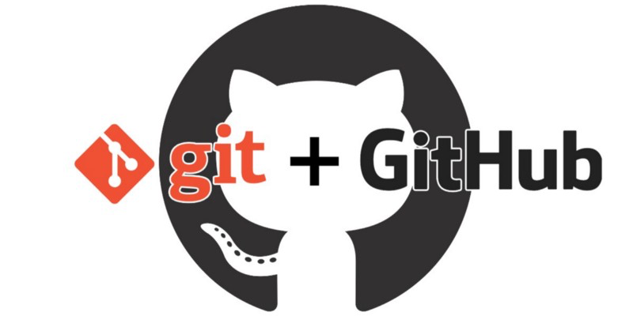

# Работа с ГИТ и ГИТХАБ

**основные команды GIT**

## Первичный конфиг

*git config --global user.name* - **имя пользователя** 

*git config --global user.email* - **почта пользователя**

## Работа с GIT

*git init* - **инициализация репозитория**

*git status* - **вывод статуса репозитория**

*git add* - **добавить файлу версионности**

*git commit -m "Комментарий"* - **фиксация изменений(публикация рабочей версии)**

*git log* - **вывод журнала изменений**

*git diff* - **сравнение изменений**

# Ветвление (Ветки)

*git branch* - **вывод информации о ветках и текущей ветки**

*git branch <NAME>* - **создать ветку NAME**

*git checkout <NAME>* - **перейти в ветку NAME**

*git checkout -b <NAME>* - **создать и перейти в ветку NAME**

*git merge <NAME>* - **слияние ветки**

*git branch -d <NAME>* - **удаление ветки**

# Локальный и Сетевой репозиторий
файл github.md

## Есть вопросы?

## Есть https://stackoverflow.com/

